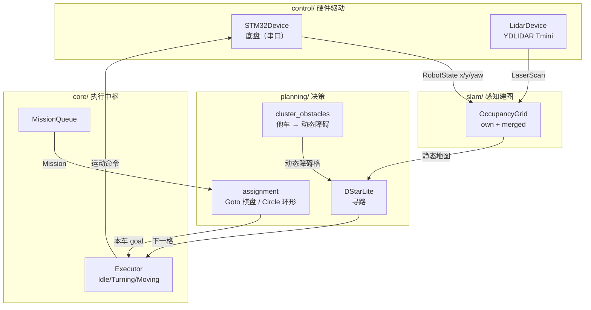
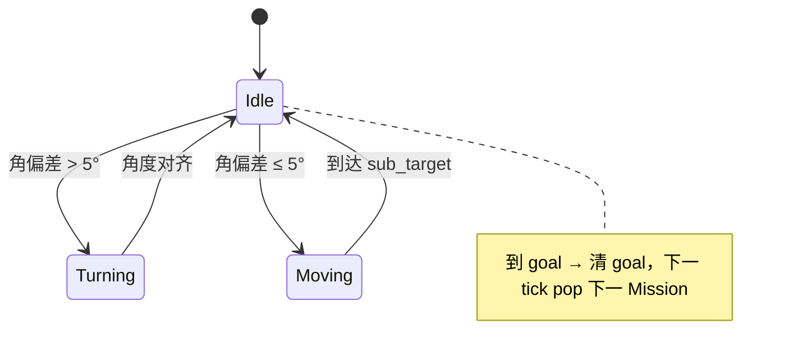
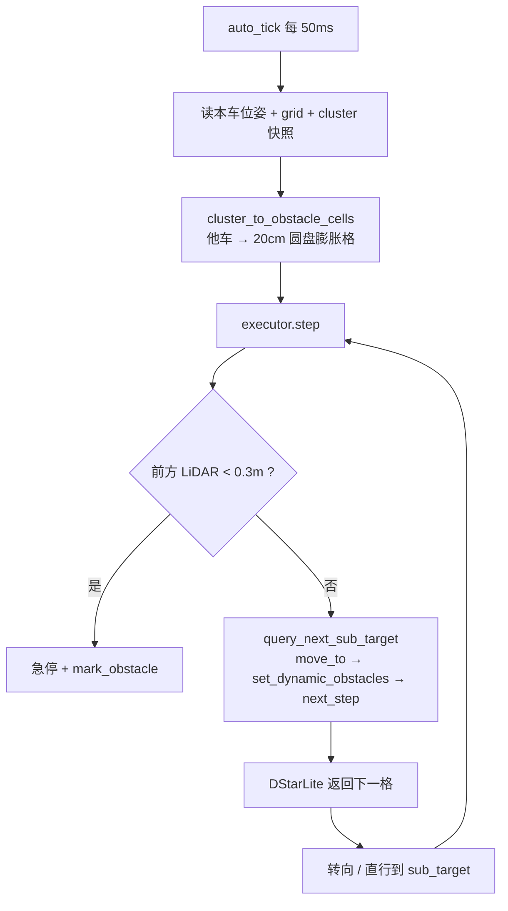
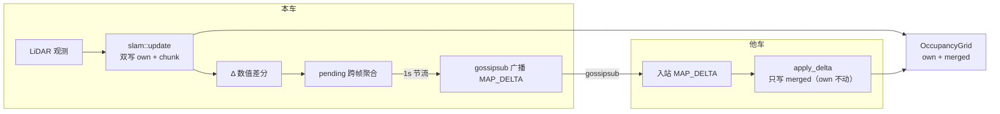
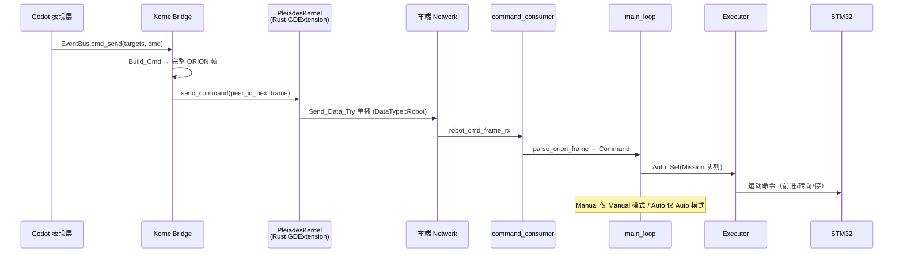

# Robot 架构说明（robot_arch）

> 创建日期：2026-08-17
> 范围：`Pleiades-Orion` 分支 Robot 子系统（`Src/Robot/` + 相关 Network 数据面）
> 对应任务：Task 14（群发 Goto）/ Task 15（多车路径规划）/ Task 17（循路改善）/ Task 18（Circle 命令）/ Task 19（mDNS 发现）
> 注：本文描述的是 **task_22 之前**的现状架构；task_22 目标架构（Rust 核心层 / Lua 决策层 / 终端层）见 `docs/design_doc/universal_robot_design.md` 与 `Task/task_22_universal_robot.md`。

---

## 1. 整体架构

### 1.1 目录结构

```
Src/Robot/
├── mod.rs                       # 模块入口 + public export
├── control/                     # 底层设备驱动（感知/执行硬件层）
│   ├── types.rs                 # CarType 枚举（X3 / X3Plus / X1 / R2 + motion_limits）
│   ├── serial/port.rs           # spawn_port(): 通用 TX+RX tokio task
│   └── device/
│       ├── stm32/               # STM32 底盘驱动（mod.rs + protocol.rs + constants.rs）
│       └── lidar/               # YDLIDAR Tmini 驱动（mod.rs + parser.rs + checksum.rs + types.rs + constants.rs）
├── slam/                        # 感知/建图层（产生地图）
│   ├── grid.rs                  # OccupancyGrid（own/merged 双表，log-odds 三态）
│   ├── lidar_mapper.rs          # 点云→栅格 + Bresenham 射线
│   └── odometry.rs              # 世界坐标积分
└── core/                        # 决策 + 执行 + 中枢
    ├── robot.rs                 # Robot::launch() + 主 select! 循环 + state_notifier/slam_task
    ├── command.rs               # 三层命令（Mode/Manual/Auto）+ Mission
    ├── command_consumer.rs      # 命令入站消费（ORION 帧 → Command）
    ├── state.rs                 # RobotState + LidarState + ExecuteState
    ├── executor.rs              # 自动任务执行器（Idle/Turning/Moving + D* Lite）
    ├── mission.rs               # MissionQueue（FIFO，replace 替换语义）
    ├── mode.rs                  # OpMode（Manual/Auto，默认 Auto）
    ├── protocol/                # ORION 统一协议
    │   ├── frame.rs             # 帧编解码（magic/len/seq/sysid/compid/msgid/payload/checksum）
    │   ├── messages.rs          # POSE/MAP_FULL/MAP_DELTA/MANUAL_CONTROL/TASK_SET 五类消息
    │   └── command_decode.rs    # parse_orion_frame → Command
    ├── cluster/                 # 集群数据面（多车）
    │   ├── cluster_info.rs      # ClusterInfo / ClusterInfoTable
    │   ├── consumer.rs          # 入站 POSE/MAP_DELTA → 表/地图
    │   └── maintenance.rs       # 周期清理失联车（2s）
    └── planning/                # 规划层（决策：去哪 + 怎么走）
        ├── assignment.rs        # 群发 Goto 棋盘散布 + Circle 环形散布
        ├── pathfinder.rs        # D* Lite 路径规划
        └── cluster_obstacles.rs # 他车 → 动态障碍格（圆形几何膨胀）
```

**分层语义**：`slam` = 感知/建图（产生地图）→ `planning` = 决策（消费地图：任务分配 + 寻路）→ `executor` = 执行（走/停 + 让行）。



### 1.2 核心数据结构

| 结构 | 位置 | 职责 |
|---|---|---|
| `RobotState` | `core/state.rs` | STM32 独占写：`vx/vy/vz`、`battery`、`attitude{yaw}`、`gyro/accel/mag`、`encoders[4]`、全局世界坐标 `x/y`（米） |
| `LidarState` | `core/state.rs` | LiDAR 独占写：`scan: Option<LaserScan>` |
| `ExecuteState` | `core/state.rs` | Executor 写：`sub_target: Option<(i32,i32)>`（本车意图，供遥测） |
| `Robot` | `core/robot.rs` | 中枢：各状态/广播通道/模式/队列/集群表句柄 |
| `Mission` | `core/command.rs` | `Goto { x, y, members }` / `Circle { x, y, members }` |
| `OpMode` | `core/mode.rs` | `Manual` / `Auto`，**默认 Auto** |
| `ClusterInfoTable` | `core/cluster/cluster_info.rs` | `HashMap<peer_id, ClusterInfo>`，他车位姿（x/y/yaw/vx/vy/sub_target） |

### 1.3 Executor 状态机（`core/executor.rs`）



- `auto_tick` 每 **50ms** 调 `step()`（仅 Auto 模式激活）。
- `ExecutorConfig`（默认值）：`sub_target_threshold_m=0.2`、`obstacle_threshold_m=0.3`、`arrival_threshold_m=0.3`、`turn_speed=10`、`move_speed=30`、`turn_align_threshold_deg=5.0`、`straight_align_threshold_deg=10.0`。

**`step_impl` 流程**（每次 tick）：

1. **① 感知**：直读 `RobotState.x/y`（世界坐标）+ `attitude.yaw`。
2. **② 实时障碍急停**：LiDAR 前方扇形（±45°）最近点 `range < 0.3m` → 立即 `stop()` + `pathfinder.mark_obstacle` + 回 Idle。
3. **③ 状态机**：
   - `Idle` → `step_idle`：检查是否到 goal → 无 goal 则 `pop_next()` 下一个 Mission → 调 `assignment` 算本车 goal → 建 `DStarLite` → `query_next_sub_target` 问下一格 → 算角偏差 → 转 `Turning` 或 `Moving`。
   - `Turning` → `step_turning`：角偏差 ≤ 阈值 → 回 Idle。
   - `Moving` → `step_moving`：到 sub_target → 问下一格（方向一致则「直行连续化」不停车，否则停车回 Idle 转向）。

### 1.4 Robot::launch 启动流程 + 主循环

`Robot::launch(port, baudrate, car_type, lidar_port, lidar_baudrate, origin, node_handle, robot_bus, robot_cmd_frame_rx, obstacle_inflation_radius, peer_name)` 依次：

1. 创建 `robot_state`（注入 `origin` 初始世界坐标）+ `lidar_state`。
2. 建广播通道 `pose_tx`/`map_tx` + `grid` + `op_mode`（默认 Auto）+ `mission_queue` + `execute_state` + `cluster_table`。
3. `STM32Device::spawn()`：RX 回调内 `feed_state_machine` → `update_state` → `odometry::accumulate` → 覆盖 `RobotState`。
4. 可选 `LidarDevice::spawn()` + `start_scan()`。
5. spawn `state_notifier`（100ms：读 state → 本地 `pose_tx` + gossip `MSGID_POSE`）。
6. spawn `slam_task`（200ms：读 pose+scan → `slam::update` 写 grid → 聚合 delta → 本地 `map_tx` + gossip `MSGID_MAP_DELTA`，每 5 帧 = 1s 节流）。
7. spawn `cluster_consumer`（订阅 robot_bus：入站 POSE 写 `cluster_table`、MAP_DELTA 写 grid merged）。
8. spawn `cluster_table_cleaner`（2s 周期清失联车）。
9. 可选 spawn `command_consumer`（`robot_cmd_frame_rx` ORION 帧 → `parse_orion_frame` → `Command` → `cmd_tx`）。
10. spawn `main_loop`。

**`main_loop`（独立 3 分支 `select!`）**：

| 分支 | 逻辑 |
|---|---|
| `cmd_rx.recv()` | `Mode`→停车+切模式+清队列+reset；`Manual`→仅 Manual 模式 `dispatch()`；`Auto`→仅 Auto 模式 `Set` 替换队列 |
| `auto_tick`（50ms，仅 Auto） | 读 state/lidar/grid 快照 + `cluster_table.snapshot()` → `cluster_to_obstacle_cells` 动态障碍 → `executor.step(...)` |
| `cancel.cancelled()` | 停车 → 停 LiDAR → 关设备 |

---

## 2. 寻路机制

### 2.1 D* Lite + 动态障碍

- 规划器：`core/planning/pathfinder.rs` 的 `DStarLite`（`g/rhs/u/km/start/goal/dynamic_obstacles`）。
- **`cost()` 判定顺序**（`pathfinder.rs`）：先查 `dynamic_obstacles`（命中 → ∞）→ 越界（∞）→ 静态 `Occupied`（∞）→ 其余 1.0。**4 连通**（无对角移动），Manhattan 启发。
- **动态障碍注入**（`core/planning/cluster_obstacles.rs`，Task 17）：`cluster_to_obstacle_cells(others, radius)` 把每辆他车（`ClusterInfo.x/y`）按「圆心 + 半径圆盘」映射为障碍格集合。

**圆形几何膨胀算法**（Task 17，半径 20cm，config `[Robot].obstacle_inflation_radius = 0.2`）：

```
reach = ceil(R / CELL_RESOLUTION) = ceil(0.2 / 0.5) = 1  → 候选 3×3 邻域
对每个候选格：圆心 (x,y) 到格矩形 [x0,x1)×[y0,y1) 的最近距离 ≤ R 则标记
  px = clamp(x, x0, x1);  py = clamp(y, y0, y1)
  dist² = (x-px)² + (y-py)² ≤ R²  → 标记该格
```

- 格中心 → 1 格；格边 → 2 格；格角 → 最多 4 格（远小于 3×3 方块，不堵通道）。


- 每次寻路前（`query_next_sub_target`）注入最新障碍：`move_to(当前格)` → `set_dynamic_obstacles(动态障碍)` → `next_step()`。
- 静态地图**不兜底**他车：`lidar_mapper` 对他车格做 `-DYNAMIC_OBSTACLE_DECAY` 主动抵消，使他车格稳定在 Unknown（可通行），避让他车**完全依赖**动态障碍膨胀。

### 2.2 Goto 命令（棋盘散布，Task 14）

`Mission::Goto { x, y, members }`：

- **单车**（`members` 空）：直接以 `(x,y)` 为 goal。
- **群发**（`members` 非空）：`assignment::group_goto_mission`：
  1. `members` 按 peer_id **字节升序**排序（不信任帧序）→ 序号 `i`。
  2. `build_slots(target, grid)` 生成位置列表 `L`：
     - `L[0]` = 精确目标点（头车，peer_id 最小）。
     - `L[1..]` = 棋盘同色格 `(gx+gy)%2==0` 的格中心，切比雪夫环由内向外（r=1..=10），环内固定顺序「正上方起顺时针」。
     - Occupied / 越界格跳过（**全局压缩 = 顺延**：被占格从列表删掉，后续所有车整体后移一位）。
  3. 本车目标 = `L[i]`。
- 所有车跑同一套确定性代码 → 同一份 `L` → **零通信、零协商、零冲突**。
- 错误：`Unreachable`（目标格障碍）/ `OutOfBounds` / `NotMember` / `InsufficientSlots`。

### 2.3 Circle 命令（环形均匀铺开，Task 18）

`Mission::Circle { x, y, members }`（`x/y` = 圆心）：

- **半径写死 0.5m = 圆心格与车格之间隔 1 格**，即车落在切比雪夫距离 2 的环 `ring_cells(2)` 上（16 格，正北起顺时针）。
- `build_circle_slots(center, grid)`：枚举 `ring_cells(2)`，过滤越界 / Occupied → 可用格列表（**圆心格 Occupied 不判失败**——围住语义，圆心本身可以是障碍）。
- `group_circle_mission`：`members` 空 → 环第一个位置（正北）；非空 → 排序取序号 `i`，**均匀铺开** `idx = i × available.len() / N`：

| N | 落点 |
|---|---|
| 1（单车） | 正北 (128,126) |
| 2 | 正北 (128,126)、正南 (128,130) —— 直径两端 |
| 3 | 近似 120° 均分 |
| 4 | 北东南西四向 |


```
Goto 棋盘散布（● = 目标点/头车，X = 同色格 (gx+gy)%2==0，其余车由内向外填充 X）：
   . X . X .
   X . X . X
   . X ● X .
   X . X . X
   . X . X .

Circle 环形散布（● = 圆心，X = ring_cells(2) 的 16 格，与圆心隔 1 格；4 车落北东南西）：
   X X X X X
   X . . . X
   X . ● . X
   X . . . X
   X X X X X
```
- 第一版：**到达即停，不朝圆心**（复用 executor 现有「到 goal 后 stop」行为）。
- 被占格先压缩掉（顺延）再均匀铺开，与 Goto 同构。

---

## 3. gossipsub 广播与地图合并

### 3.1 广播内容（gossipsub topics）

| Topic 常量 | 内容 | 发布方 |
|---|---|---|
| `TOPIC_PEER_INFO` | 节点身份 `{"name": ...}` | Network（连接建立后） |
| `TOPIC_MODELS` | 模型能力 `Vec<SupportedModel>` | Network |
| `TOPIC_SESSIONS` | 会话状态 `Vec<SessionSummary>` | Network |
| `TOPIC_ROBOT_POSE` | ORION `MSGID_POSE` 二进制帧（他车位姿） | `state_notifier`（100ms） |
| `TOPIC_ROBOT_MAP` | ORION `MSGID_MAP_DELTA` 二进制帧（地图增量） | `slam_task`（200ms，节流 1s） |

**Robot 侧两条广播链**：

- `state_notifier`（100ms）：读 `RobotState` → 组 `PoseData{x,y,yaw,vx,vy,sub_target}` → 本地 `pose_tx` + gossip `TOPIC_ROBOT_POSE`。
- `slam_task`（200ms，每 5 帧 = 1s 节流）：读 pose + LiDAR scan → `slam::update` 返回 deltas → 跨帧聚合 → `map_tx` + gossip `TOPIC_ROBOT_MAP`。

### 3.2 地图如何整合合并（CRDT 差分思想）

`OccupancyGrid`（`slam/grid.rs`）为**双表结构**：

| 表 | 含义 | 写方 |
|---|---|---|
| `chunk`（merged） | 合并视图：本车观测 + 远端增量 | 本车 `slam::update` + 远端 `apply_delta` |
| `own` | **仅本车观测贡献**（对账上传数据源） | 仅本车 `slam::update` |

- **概率 log-odds 三态**：命中 `+3`、漏打 `-1`，夹断 `±8`；`>+6 → Occupied`、`<-6 → Free`、中间 `Unknown`。
- **本车观测**：`grid.update(gx, gy, occupied)` **双写** own 与 chunk。
- **远端增量合并**：`cluster_consumer` 收到他车 `MSGID_MAP_DELTA` → `grid.apply_delta(gx, gy, delta)` **只写 merged（chunk），不碰 own**（防止他车贡献混入本车 own 导致对账双倍计数）。
- **差分广播**：每帧 `Δ = 新 log − 旧 log`（真实数值差分），跨帧聚合净变化后广播；接收方 `apply_delta` 直接 `merged += Δ` 并 clamp ±8，完成精确重放。
- **动态障碍掩蔽**：广播前对他车格做 `-DYNAMIC_OBSTACLE_DECAY`（=-3）抵消 LiDAR 命中，使他车格在静态地图中稳定在 Unknown（避免把「移动的他车」误标成静态障碍）。



---

## 4. 控制链条

### 4.1 地面站（Pictor）侧架构

地面站是**独立的 Godot 工程**（`GodotProject/Pictor/`），通过 Orion 仓库内的 GDExtension 桥 crate（`SrcPictorKernel/`，GodotClass `PleiadesKernel`）接入 libp2p 网络（Task 16 建桥 / Task 23 切桥，2026-08-16 已实施）。原则：**逻辑与表现分离，桥 = 哑管道**（Rust 侧不解析、不合并业务数据，只透传原始 ORION 帧 + peer 事件）。

```
Godot 进程（单进程）
├── KernelBridge（Godot，薄适配器）
│     ├── 上行：robot_frame → parse_orion_frame → EventBus；peer_* → EventBus
│     └── 下行：EventBus.cmd_send → Build_Cmd → kernel.send_command
├── PleiadesKernel（Rust GDExtension = SrcPictorKernel，哑管道）
│     └── libp2p swarm（mDNS 自动发现 / gossipsub 广播 / Send_Data_Try 单播）
└── 表现层（Renderer2D / VehiclePanelManager / Camera / ControlMaster）
```

- 桥内 Pleiades 以**无 TUI** 模式跑后台 tokio 线程（ML/API/VM 照常，仅不启动 `Src/TUI/`）。
- Godot 侧复用 WS 时代的 `parse_orion_frame` / `MapData2D` / `Renderer2D` / 控制链路，只把「数据源」从 WS socket 换成 `robot_frame` 信号。

### 4.2 网络栈与节点发现（mDNS）

`Network_Service` 的 libp2p Swarm 行为组合（`network_service.rs`）：**TCP + Noise + Yamux + mDNS + Kademlia + Request-Response + Gossipsub + Identify + Ping**。**地面站（Pictor 桥内）与车端共用同一套发现机制**。

- **mDNS 局域网发现**（`mdns::tokio::Behaviour`）：UDP 组播（`224.0.0.251:5353`）。
  - Task 19 起缩短间隔：`query_interval = 20s`、`ttl = 60s`（默认 5min/6min，丢包后自愈极慢）。
  - `mdns::Event::Discovered` → `kademlia.add_address` + 主动 `dial` → `ConnectionEstablished` → `PeerManager.Upsert_Peer` 注册。
  - 抗 Wi-Fi 漫游：mDNS 发现后自动 `dial` 重连（WebSocket 时代 TCP 会被 AP 切换杀光，libp2p 不断线）。
- Kademlia 仅在 `WAN` 时 `bootstrap()`（局域网默认关闭，仅作 mDNS 喂地址的路由表）；`bootstrap_peers` 默认空（**当前无静态兜底**，见 `robot_review_problem.md` N14）。

### 4.3 控制下发链条（地面站 → 车，完整链路）

```
地面站 Godot：EventBus.cmd_send(targets, cmd)
  │ KernelBridge._on_cmd_send：
  │   TASK_SET 缺 members 时用 targets 自动填充（hex → 字节）
  │   frame = OrionMessages.Build_Cmd(cmd)     ← Godot 拼好完整 ORION 帧
  ▼
Rust PleiadesKernel：send_command(peer_id_hex, frame) → Send_Data_Try 单播（DataType::Robot）
  │ libp2p request-response（unicast，不混入 gossip 遥测）
  ▼
车端 Network：Handle_Request_Response_Event → DataType::Robot → robot_cmd_frame_tx 通道
  ▼
command_consumer：decode_frame → parse_orion_frame → Command ──► cmd_tx
  ▼
main_loop 收 Command，按 op_mode 分发：
  ├─ Mode { SwitchToManual / SwitchToAuto }   → 停车 + 切模式
  ├─ Manual { Forward/Backward/Spin/Stop/Beep/... }  → 仅 Manual 模式 dispatch()（Auto 模式忽略）
  └─ Auto { Set(Vec<Mission>) }               → 仅 Auto 模式：停车 + 替换队列 + executor.reset()
```

- 命令走 **request-response unicast**，车端收到后回 `OK` ACK 闭环。
- `parse_orion_frame` 对 `MSGID_TASK_SET` 按 `member_count` 三分支：`0` 取消 / `1` 单车 / `>1` 群发（取第一个 Goto 或 Circle + members 透传）。



### 4.4 遥测上行链条（车 → 地面站/他车）

```
车端 state_notifier（100ms）─► MSGID_POSE ──gossip──► TOPIC_ROBOT_POSE
车端 slam_task（200ms/1s节流）─► MSGID_MAP_DELTA ──gossip──► TOPIC_ROBOT_MAP
                                    │
                 ┌──────────────────┴──────────────────┐
                 ▼                                     ▼
        Rust PleiadesKernel（地面站）             他车 cluster_consumer
        robot_bus → robot_frame 信号              POSE → ClusterInfoTable
                 ▼                                MAP_DELTA → grid.apply_delta
        Godot _on_robot_frame：parse_orion_frame → EventBus：
          MSGID_POSE      → pose_received(vid, data)
          MSGID_MAP_FULL  → map_full_received(vid, chunk_x, chunk_y, cells)
          MSGID_MAP_DELTA → map_delta_received(voxels)
```

- **地面站地图渲染**：`MAP_FULL` = 替换（`set_full`）、`MAP_DELTA` = 累加（`set_delta`），多车朴素共表（多车合并一致性暂缓）。
- **他车侧** `cluster_consumer` 消费：
  - 入站 POSE → 写 `ClusterInfoTable`（供本车动态障碍注入）。
  - 入站 MAP_DELTA → `grid.apply_delta`（合并到 merged，own 不动）。

### 4.5 车辆生命周期（peer 事件驱动）

地面站对车辆「显示/移除」完全由 peer 事件驱动（不依赖心跳超时）：

| peer 事件 | 来源 | 地面站动作 |
|---|---|---|
| `peer_connected` | 连接建立 | `vehicle_registered` → 面板 + Sprite 显示 |
| `peer_disconnected` | 连接断开 | `vehicle_unregistered` → 移除面板 + Sprite |
| `peer_info_updated` | gossipsub peer-info | 面板「连接中」→ 车名 |
| `peer_discovered` / `peer_left` | mDNS 发现/过期 | **不消费**（mDNS 过期 ≠ 断连） |

---

## 附：关键常量速查

| 常量 | 值 | 含义 |
|---|---|---|
| `CELL_RESOLUTION` | 0.5 m/格 | 栅格分辨率（格 50cm×50cm） |
| `CHUNK_SIZE` | 256 | 单 Chunk 格数（256×256，覆盖 128m×128m） |
| `obstacle_inflation_radius` | 0.2 m（config 可配） | 他车动态障碍膨胀半径（Task 17） |
| `CIRCLE_RING_RADIUS_CELLS` | 2 | Circle 环半径（= 与圆心隔 1 格） |
| `auto_tick` | 50 ms | Executor 主 tick |
| `state_notifier` | 100 ms | 位姿广播周期 |
| `slam_task` | 200 ms（节流 1s） | 建图 + 增量广播周期 |
| mDNS `query_interval` / `ttl` | 20s / 60s | 局域网发现调参（Task 19） |
