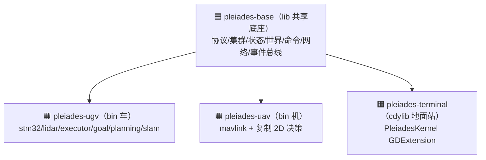
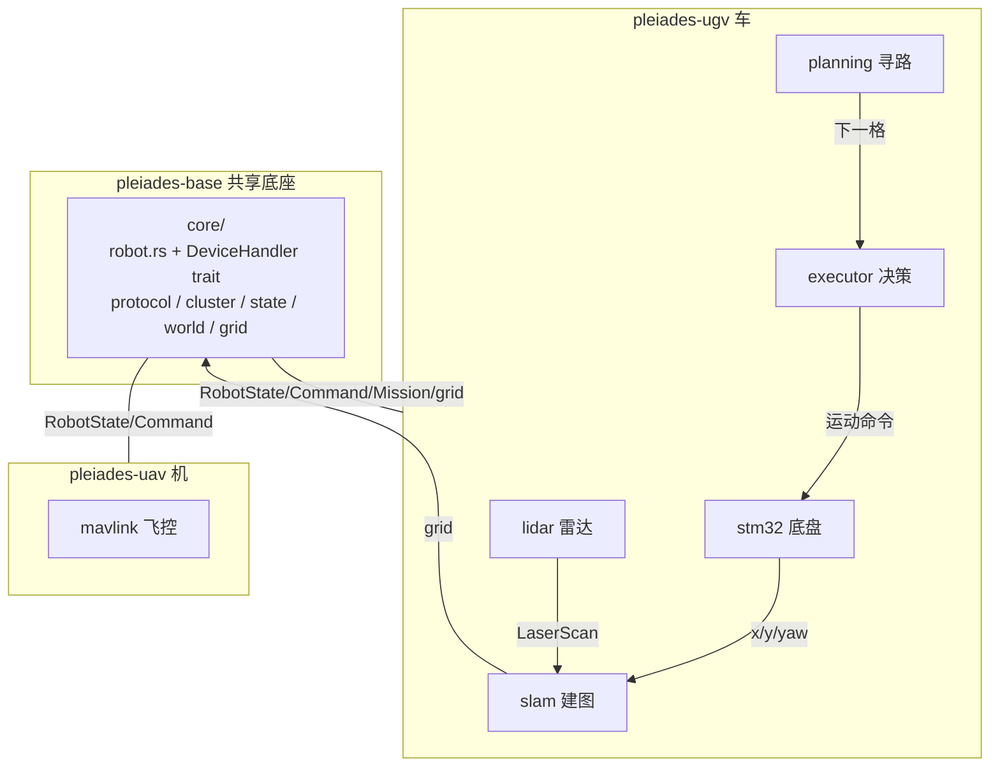
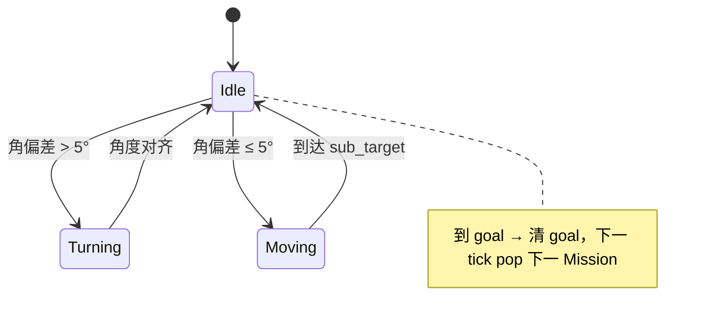
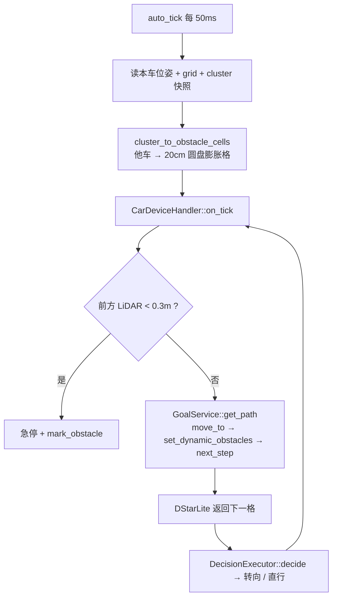
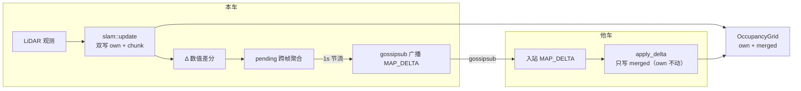
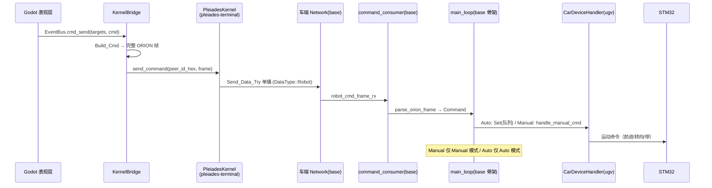

# Robot 架构说明（robot_arch）

> 创建日期：2026-08-17
> 更新日期：2026-08-31（新增 §7 RTK 定位接入规划）
> 范围：Robot 子系统（workspace 四 crate + 相关 Network 数据面）
> 对应任务：Task 14（群发 Goto）/ Task 15（多车路径规划）/ Task 17（循路改善）/ Task 18（Circle 命令）/ Task 19（mDNS 发现）/ Task 23（crate 拆分：底座共享 + 设备端独有）

---

## 0. 总体形态：一个底座 + 三个终端

Task 23 把「一份代码适配所有设备」重构为「**底座共享 + 设备端独有**」——异构设备在「共享世界状态」层同构、在「设备实现」层异构，底座只统一前者，后者各写各的。

```toml
[workspace]
members = ["pleiades-base", "pleiades-ugv", "pleiades-uav", "pleiades-terminal"]
```



- **底座单一来源**：协议/集群/状态/世界的定义在 `pleiades-base` 一处，三个终端同时生效。
- **设备端彻底分离**：车的二进制没有 mavlink，机没有 stm32，地面站没有车机驱动。
- **各自编译**：`cargo build -p pleiades-ugv / -p pleiades-uav / -p pleiades-terminal` 互不拖累。

---

## 1. 整体架构

### 1.1 目录结构（workspace 四 crate）

```text
pleiades-base/                    # 🟦 lib 共享底座（车/机/地面站同一份）
└── src/
    ├── lib.rs                    # 模块声明 + pub use 导出
    ├── main.rs                   # [[bin]] Pleiades（PC 纯推理节点）
    ├── bootstrap.rs              # core_bootstrap()：配置→日志→EventBus→Storage→Network→Core
    ├── Config/ Network/ ML_Engine/ PeerManagement/ Orchestrator/
    │   Storage/ Session_Manager/ EventBus/ TUI/ CLI/ VM/ API/   # 共享基础设施
    └── Robot/
        ├── mod.rs                # pub mod core; pub mod util; + re-export
        ├── core/                 # 🟦 底座核心（共享，车机同一份）
        │   ├── robot.rs          # Robot::new() + DeviceHandler trait + 主循环骨架
        │   ├── command.rs        # 三层命令（Mode/Manual/Auto）+ Mission
        │   ├── command_consumer.rs  # 命令入站消费（ORION 帧 → Command）
        │   ├── mission.rs        # MissionQueue（FIFO，replace 替换语义）
        │   ├── mode.rs           # OpMode（Manual/Auto，默认 Auto）
        │   ├── state.rs          # RobotState / ExecuteState / DecisionState
        │   ├── protocol/         # ORION 统一协议
        │   │   ├── frame.rs      # 帧编解码（magic/len/seq/sysid/compid/msgid/payload/checksum）
        │   │   ├── messages.rs   # POSE/MAP_FULL/MAP_DELTA/MANUAL_CONTROL/TASK_SET 五类消息
        │   │   └── command_decode.rs  # parse_orion_frame → Command
        │   ├── cluster/          # 集群数据面（多车）
        │   │   ├── cluster_info.rs   # ClusterInfo / ClusterInfoTable
        │   │   ├── consumer.rs       # 入站 POSE/MAP_DELTA → 表/地图
        │   │   └── maintenance.rs    # 周期清理失联车（2s）
        │   ├── grid.rs           # OccupancyGrid（own/merged 双表，log-odds 三态）
        │   ├── world.rs          # 世界（grid + cluster，纯地图只读接口 get_cell/get_agents）
        │   └── map_delta.rs      # MapDelta 地图增量协议类型
        └── util/
            └── serial/           # 通用串口 TX+RX 收发（spawn_port，车机共用）

pleiades-ugv/                     # 🟧 bin 车设备端（独有）
└── src/
    ├── main.rs                   # 入口（core_bootstrap + parse_origin + ugv_bootstrap）
    ├── config.rs                 # UgvConfig = flatten BaseConfig + chassis/lidar/obstacle_inflation_radius
    ├── bootstrap.rs              # ugv_bootstrap()：Robot::new + CarDeviceHandler
    └── ugv/
        ├── mod.rs
        ├── types.rs              # CarType 枚举（X3 / X3Plus / X1 / R2 + motion_limits）
        ├── stm32/                # STM32 底盘驱动（mod.rs + protocol.rs + constants.rs）
        ├── lidar/                # YDLIDAR Tmini 驱动（mod.rs + parser.rs + checksum.rs + types.rs + constants.rs）
        ├── executor.rs           # DecisionExecutor 决策执行器（三状态机，纯决策零副作用）
        ├── goal.rs               # GoalService 目标服务（到达检测 + 任务切换 + D* 寻路）
        ├── emergency_stop.rs     # 急停（前方扇形障碍强制 stop）
        ├── planning/             # 规划层（assignment + pathfinder + cluster_obstacles）
        ├── slam/                 # lidar_mapper + task + odometry（车 2D 建图）
        └── robot_handler.rs      # CarDeviceHandler（实现 DeviceHandler）

pleiades-uav/                     # 🟧 bin 机设备端（独有）
└── src/
    ├── main.rs                   # 入口（core_bootstrap + parse_origin + uav_bootstrap）
    ├── config.rs                 # UavConfig = flatten BaseConfig + flight_ctrl
    ├── bootstrap.rs              # uav_bootstrap()：Robot::new + UavDeviceHandler
    └── uav/
        ├── mod.rs
        ├── mavlink/              # MAVLink 飞控驱动（mod.rs + protocol.rs + types.rs + constants.rs）
        ├── robot_handler.rs      # UavDeviceHandler（实现 DeviceHandler，on_tick 已接 2D 决策）
        ├── executor.rs           # 车 2D 三状态机（已接线；后 3D 化）
        ├── goal.rs               # 车 2D 目标服务（已接线）
        └── planning/             # 车 2D 寻路（已接线；后 3D）

pleiades-terminal/                # 🟧 cdylib 地面站（独有，原 SrcPictorKernel）
└── src/
    └── lib.rs                    # PleiadesKernel（GodotClass，哑管道桥）
```

**分层语义**：`base`（协议/状态/世界/命令/集群，共享）→ 设备端 `ugv`/`uav`（驱动 + 决策 + 寻路 + 建图，各写各的）→ `terminal`（地面站，纯透传）。



### 1.2 核心数据结构

| 结构 | 位置 | 职责 |
|---|---|---|
| `RobotState` | `base/robot/core/state.rs` | 位姿 schema：`vx/vy/vz`、`battery`、`attitude{yaw}`、`gyro/accel/mag`、世界坐标 `x/y/z`（米）。**设备端 RX 回调单一写入** |
| `ExecuteState` | `base/robot/core/state.rs` | main_loop 唯一写：`state`（DecisionState）+ `sub_target: Option<(i32,i32)>`（本车意图，供遥测） |
| `DecisionState`/`MotionAction`/`DecisionResult` | `base/robot/core/state.rs` | 决策层三件套（Idle/Turning/Moving + 动作意图），设备端决策器消费 |
| `Robot` | `base/robot/core/robot.rs` | 中枢：共享状态/广播通道/模式/队列/集群表句柄；`new()` 建共享态，`run(device)` 跑主循环骨架 |
| `DeviceHandler` trait | `base/robot/core/robot.rs` | **设备处理器接口**：`start`/`handle_manual_cmd`/`reset`/`on_tick`/`stop`/`shutdown`（设备端各自实现，底座不依赖具体设备类型） |
| `Mission` | `base/robot/core/command.rs` | `Goto { x, y, members }` / `Circle { x, y, members }` |
| `OpMode` | `base/robot/core/mode.rs` | `Manual` / `Auto`，**默认 Auto** |
| `ClusterInfoTable` | `base/robot/core/cluster/cluster_info.rs` | `HashMap<peer_id, ClusterInfo>`，他车位姿（x/y/yaw/vx/vy/sub_target） |
| `OccupancyGrid` | `base/robot/core/grid.rs` | 地图表示（own/merged 双表 + log-odds），CRDT 合并前提 |
| `CarType` | `ugv/types.rs` | 车型枚举（车独有） |
| `Telemetry` | `uav/mavlink/types.rs` | 飞控遥测快照（机独有） |

> **独有状态跟设备走**（Task 23 阶段 B）：`encoders[4]` → STM32 device 内部、`LidarState` → Lidar device 内部（`get_scan()`），均不在共享 `RobotState`。

### 1.3 Executor 状态机（`ugv/executor.rs`，车决策）



- `DecisionExecutor::decide(next_cell, x, y, yaw, current) -> DecisionResult`：**纯决策、零副作用**（不发命令不写状态，结果由 main_loop 单点执行）。
- `auto_tick` 每 **50ms** 调 `DeviceHandler::on_tick()`（仅 Auto 模式激活）。
- 决策阈值：`sub_target_threshold_m=0.2`、`arrival_threshold_m=0.3`、`turn_speed=10`、`move_speed=30`、`turn_align_threshold_deg=5.0`、`straight_align_threshold_deg=10.0`。

**`on_tick` 流程**（车端 `CarDeviceHandler`，每次 tick）：

1. **① 急停**：LiDAR 前方扇形（±45°）最近点 `range < 0.3m` → 立即 `stop()` + `GoalService::mark_obstacle` + 清意图（`ugv/emergency_stop.rs`）。
2. **② 决策**：`GoalService::get_path()` 寻路得下一格 → `DecisionExecutor::decide` 得 `DecisionResult` → 写 `ExecuteState` → 若有 `action` 则 `stm32.apply_action(action)`。

### 1.4 启动流程 + 主循环（Robot::new + DeviceHandler）

**装配下沉**（Task 23 C0）：共享装配在 base 的 `core_bootstrap()`；设备装配在各终端 crate 的 `ugv_bootstrap`/`uav_bootstrap`。

```text
各终端 main.rs：
  core_bootstrap()                          ← base：配置→日志→EventBus/Storage→Network→Core
  Ensure_Ugv_Config() / Ensure_Uav_Config() ← 设备端：读自己的设备段
  ugv_bootstrap(config, node_handle, robot_bus, robot_cmd_frame_rx, origin)
     └─ Robot::new(origin, node_handle, robot_bus, robot_cmd_frame_rx, peer_name)
          └─ 建共享状态 + spawn 非设备 task（state_notifier / cluster_consumer / cluster_cleaner / command_consumer）
        CarDeviceHandler::new(robot, config, node_handle, origin)   ← 设备处理器
        robot.run(device, cmd_rx)          ← spawn 主循环骨架（后台）
  boot.run()                               ← base：阻塞（network 事件循环 + TUI + Core）
```

`Robot::new` 依次：建 `robot_state`（注入 `origin`）+ 广播通道 `pose_tx`/`map_tx` + `grid` + `op_mode` + `mission_queue` + `execute_state` + `cluster_table`；spawn `state_notifier`（100ms 位姿广播）、`cluster_consumer`（入站 POSE/MAP_DELTA）、`cluster_table_cleaner`（2s 清失联）、`command_consumer`（ORION 帧 → Command）。

`Robot::run(device)` 跑主循环骨架（**纯路由，设备操作全走 `DeviceHandler`**）：

| 分支 | 逻辑 |
|---|---|
| 启动 | `device.start()`（设备自管理启动：车 spawn stm32+lidar+goal_service，机 spawn mavlink） |
| `cmd_rx.recv()` | `Mode`→停车+切模式+清队列+`device.reset()`；`Manual`→仅 Manual 模式 `device.handle_manual_cmd()`；`Auto`→仅 Auto 模式 `Set` 替换队列 + `device.reset()` |
| `auto_tick`（50ms，仅 Auto） | 读 `RobotState` 快照 → `device.on_tick(&rs, &execute_state)`（急停+决策+发动作，设备端实现） |
| `cancel.cancelled()` | `device.stop()` → `device.shutdown()`（停车 + 关设备） |

---

## 2. 寻路机制（`ugv/planning/`，车）

### 2.1 D* Lite + 动态障碍

- 规划器：`ugv/planning/pathfinder.rs` 的 `DStarLite`（`g/rhs/u/km/start/goal/dynamic_obstacles`）。
- **`cost()` 判定顺序**（`pathfinder.rs`）：先查 `dynamic_obstacles`（命中 → ∞）→ 越界（∞）→ 静态 `Occupied`（∞）→ 其余 1.0。**4 连通**（无对角移动），Manhattan 启发。
- **动态障碍注入**（`ugv/planning/cluster_obstacles.rs`，Task 17）：`cluster_to_obstacle_cells(others, radius)` 把每辆他车（`ClusterInfo.x/y`）按「圆心 + 半径圆盘」映射为障碍格集合。
- **寻路下沉**（Task 23 决策 D1）：`DStarLite` 由 `GoalService`（`ugv/goal.rs`）直接持有；`world` 只保留纯地图只读接口 `get_cell`/`get_agents`，不再内嵌寻路。

**圆形几何膨胀算法**（Task 17，半径 20cm，config `obstacle_inflation_radius = 0.2`，ugv 顶层键）：

```
reach = ceil(R / CELL_RESOLUTION) = ceil(0.2 / 0.5) = 1  → 候选 3×3 邻域
对每个候选格：圆心 (x,y) 到格矩形 [x0,x1)×[y0,y1) 的最近距离 ≤ R 则标记
  px = clamp(x, x0, x1);  py = clamp(y, y0, y1)
  dist² = (x-px)² + (y-py)² ≤ R²  → 标记该格
```

- 格中心 → 1 格；格边 → 2 格；格角 → 最多 4 格（远小于 3×3 方块，不堵通道）。


- 每次寻路前（`GoalService::get_path`）注入最新障碍：`move_to(当前格)` → `set_dynamic_obstacles(动态障碍)` → `next_step()`。
- 静态地图**不兜底**他车：`lidar_mapper` 对他车格做 `-DYNAMIC_OBSTACLE_DECAY` 主动抵消，使他车格稳定在 Unknown（可通行），避让他车**完全依赖**动态障碍膨胀。

### 2.2 Goto 命令（棋盘散布，Task 14）

`Mission::Goto { x, y, members }`：

- **单车**（`members` 空）：直接以 `(x,y)` 为 goal。
- **群发**（`members` 非空）：`assignment::group_goto_mission`：
  1. `members` 按 peer_id **字节升序**排序（不信任帧序）→ 序号 `i`。
  2. `build_slots(target, grid)` 生成位置列表 `L`：
     - `L[0]` = 精确目标点（头车，peer_id 最小）。
     - `L[1..]` = 棋盘同色格 `(gx+gy)%2==0` 的格中心，切比雪夫环由内向外（r=1..=10），环内固定顺序「正上方起顺时针」。
     - Occupied / 越界格跳过（**全局压缩 = 顺延**：被占格从列表删掉，后续所有车整体后移一位）。
  3. 本车目标 = `L[i]`。
- 所有车跑同一套确定性代码 → 同一份 `L` → **零通信、零协商、零冲突**。
- 错误：`Unreachable`（目标格障碍）/ `OutOfBounds` / `NotMember` / `InsufficientSlots`。

### 2.3 Circle 命令（环形均匀铺开，Task 18）

`Mission::Circle { x, y, members }`（`x/y` = 圆心）：

- **半径写死 0.5m = 圆心格与车格之间隔 1 格**，即车落在切比雪夫距离 2 的环 `ring_cells(2)` 上（16 格，正北起顺时针）。
- `build_circle_slots(center, grid)`：枚举 `ring_cells(2)`，过滤越界 / Occupied → 可用格列表（**圆心格 Occupied 不判失败**——围住语义，圆心本身可以是障碍）。
- `group_circle_mission`：`members` 空 → 环第一个位置（正北）；非空 → 排序取序号 `i`，**均匀铺开** `idx = i × available.len() / N`：

| N | 落点 |
|---|---|
| 1（单车） | 正北 (128,126) |
| 2 | 正北 (128,126)、正南 (128,130) —— 直径两端 |
| 3 | 近似 120° 均分 |
| 4 | 北东南西四向 |

```
Goto 棋盘散布（● = 目标点/头车，X = 同色格 (gx+gy)%2==0，其余车由内向外填充 X）：
   . X . X .
   X . X . X
   . X ● X .
   X . X . X
   . X . X .

Circle 环形散布（● = 圆心，X = ring_cells(2) 的 16 格，与圆心隔 1 格；4 车落北东南西）：
   X X X X X
   X . . . X
   X . ● . X
   X . . . X
   X X X X X
```
- 第一版：**到达即停，不朝圆心**（复用 executor 现有「到 goal 后 stop」行为）。
- 被占格先压缩掉（顺延）再均匀铺开，与 Goto 同构。

---

## 3. gossipsub 广播与地图合并

### 3.1 广播内容（gossipsub topics）

| Topic 常量 | 内容 | 发布方 |
|---|---|---|
| `TOPIC_PEER_INFO` | 节点身份 `{"name": ...}` | Network（连接建立后） |
| `TOPIC_MODELS` | 模型能力 `Vec<SupportedModel>` | Network |
| `TOPIC_SESSIONS` | 会话状态 `Vec<SessionSummary>` | Network |
| `TOPIC_ROBOT_POSE` | ORION `MSGID_POSE` 二进制帧（他车位姿） | `state_notifier`（100ms） |
| `TOPIC_ROBOT_MAP` | ORION `MSGID_MAP_DELTA` 二进制帧（地图增量） | `slam_task`（200ms，节流 1s） |

**Robot 侧两条广播链**：

- `state_notifier`（100ms，base `core/robot.rs`）：读 `RobotState` → 组 `PoseData{x,y,yaw,vx,vy,sub_target}` → 本地 `pose_tx` + gossip `TOPIC_ROBOT_POSE`。
- `slam_task`（200ms，每 5 帧 = 1s 节流，ugv `slam/task.rs`）：读 pose + LiDAR scan → `slam::update` 返回 deltas → 跨帧聚合 → `map_tx` + gossip `TOPIC_ROBOT_MAP`。

### 3.2 地图如何整合合并（CRDT 差分思想）

`OccupancyGrid`（base `core/grid.rs`）为**双表结构**：

| 表 | 含义 | 写方 |
|---|---|---|
| `chunk`（merged） | 合并视图：本车观测 + 远端增量 | 本车 `slam::update` + 远端 `apply_delta` |
| `own` | **仅本车观测贡献**（对账上传数据源） | 仅本车 `slam::update` |

- **概率 log-odds 三态**：命中 `+3`、漏打 `-1`，夹断 `±8`；`>+6 → Occupied`、`<-6 → Free`、中间 `Unknown`。
- **本车观测**：`grid.update(gx, gy, occupied)` **双写** own 与 chunk。
- **远端增量合并**：`cluster_consumer` 收到他车 `MSGID_MAP_DELTA` → `grid.apply_delta(gx, gy, delta)` **只写 merged（chunk），不碰 own**（防止他车贡献混入本车 own 导致对账双倍计数）。
- **差分广播**：每帧 `Δ = 新 log − 旧 log`（真实数值差分），跨帧聚合净变化后广播；接收方 `apply_delta` 直接 `merged += Δ` 并 clamp ±8，完成精确重放。
- **动态障碍掩蔽**：广播前对他车格做 `-DYNAMIC_OBSTACLE_DECAY`（=-3）抵消 LiDAR 命中，使他车格在静态地图中稳定在 Unknown（避免把「移动的他车」误标成静态障碍）。



---

## 4. 控制链条

### 4.1 地面站（Pictor）侧架构

地面站是**独立的 Godot 工程**（`GodotProject/Pictor/`），通过 Orion 仓库内的 GDExtension 桥 crate（`pleiades-terminal/`，GodotClass `PleiadesKernel`，原 `SrcPictorKernel/`）接入 libp2p 网络（Task 16 建桥 / Task 23 C4 拆 crate）。原则：**逻辑与表现分离，桥 = 哑管道**（Rust 侧不解析、不合并业务数据，只透传原始 ORION 帧 + peer 事件）。

```
Godot 进程（单进程）
├── KernelBridge（Godot，薄适配器）
│     ├── 上行：robot_frame → parse_orion_frame → EventBus；peer_* → EventBus
│     └── 下行：EventBus.cmd_send → Build_Cmd → kernel.send_command
├── PleiadesKernel（Rust GDExtension = pleiades-terminal，哑管道）
│     └── libp2p swarm（mDNS 自动发现 / gossipsub 广播 / Send_Data_Try 单播）
└── 表现层（Renderer2D / VehiclePanelManager / Camera / ControlMaster）
```

- 桥内 Pleiades 以**无 TUI** 模式跑后台 tokio 线程（`core_bootstrap()` + `run_headless()`，ML/API/VM 照常，仅不启动 TUI）。
- Godot 侧复用 WS 时代的 `parse_orion_frame` / `MapData2D` / `Renderer2D` / 控制链路，只把「数据源」从 WS socket 换成 `robot_frame` 信号。

### 4.2 网络栈与节点发现（mDNS）

`Network_Service` 的 libp2p Swarm 行为组合（`network_service.rs`，base）：**TCP + Noise + Yamux + mDNS + Kademlia + Request-Response + Gossipsub + Identify + Ping**。**地面站（terminal 桥内）与车/机端共用同一套发现机制**。

- **mDNS 局域网发现**（`mdns::tokio::Behaviour`）：UDP 组播（`224.0.0.251:5353`）。
  - Task 19 起缩短间隔：`query_interval = 20s`、`ttl = 60s`（默认 5min/6min，丢包后自愈极慢）。
  - `mdns::Event::Discovered` → `kademlia.add_address` + 主动 `dial` → `ConnectionEstablished` → `PeerManager.Upsert_Peer` 注册。
  - 抗 Wi-Fi 漫游：mDNS 发现后自动 `dial` 重连（WebSocket 时代 TCP 会被 AP 切换杀光，libp2p 不断线）。
- Kademlia 仅在 `WAN` 时 `bootstrap()`（局域网默认关闭，仅作 mDNS 喂地址的路由表）；`bootstrap_peers` 默认空（**当前无静态兜底**，见 `robot_review_problem.md` N14）。

### 4.3 控制下发链条（地面站 → 车，完整链路）

```
地面站 Godot：EventBus.cmd_send(targets, cmd)
  │ KernelBridge._on_cmd_send：
  │   TASK_SET 缺 members 时用 targets 自动填充（hex → 字节）
  │   frame = OrionMessages.Build_Cmd(cmd)     ← Godot 拼好完整 ORION 帧
  ▼
Rust PleiadesKernel（terminal）：send_command(peer_id_hex, frame) → Send_Data_Try 单播（DataType::Robot）
  │ libp2p request-response（unicast，不混入 gossip 遥测）
  ▼
车端 Network（base）：Handle_Request_Response_Event → DataType::Robot → robot_cmd_frame_tx 通道
  ▼
command_consumer（base）：decode_frame → parse_orion_frame → Command ──► cmd_tx
  ▼
main_loop（base 骨架）收 Command，按 op_mode 分发到 device：
  ├─ Mode { SwitchToManual / SwitchToAuto }   → 停车 + 切模式 + device.reset()
  ├─ Manual { Forward/Backward/Spin/Stop/Beep/Takeoff/Land/... }  → 仅 Manual 模式 device.handle_manual_cmd()
  └─ Auto { Set(Vec<Mission>) }               → 仅 Auto 模式：停车 + 替换队列 + device.reset()
```

- 命令走 **request-response unicast**，车端收到后回 `OK` ACK 闭环。
- `parse_orion_frame` 对 `MSGID_TASK_SET` 按 `member_count` 三分支：`0` 取消 / `1` 单车 / `>1` 群发（取第一个 Goto 或 Circle + members 透传）。
- `ManualCmd` 超集共享 + **设备选择性响应**（车响应 Beep/StartLidarScan 不响应 Takeoff；机响应 Takeoff/Land 不响应 Beep），能力差异靠「响应」而非「声明」表达。



### 4.4 遥测上行链条（车 → 地面站/他车）

```
车端 state_notifier（100ms，base）─► MSGID_POSE ──gossip──► TOPIC_ROBOT_POSE
车端 slam_task（200ms/1s节流，ugv）─► MSGID_MAP_DELTA ──gossip──► TOPIC_ROBOT_MAP
                                    │
                 ┌──────────────────┴──────────────────┐
                 ▼                                     ▼
        Rust PleiadesKernel（terminal）            他车 cluster_consumer（base）
        robot_bus → robot_frame 信号              POSE → ClusterInfoTable
                 ▼                                MAP_DELTA → grid.apply_delta
        Godot _on_robot_frame：parse_orion_frame → EventBus：
          MSGID_POSE      → pose_received(vid, data)
          MSGID_MAP_FULL  → map_full_received(vid, chunk_x, chunk_y, cells)
          MSGID_MAP_DELTA → map_delta_received(voxels)
```

- **地面站地图渲染**：`MAP_FULL` = 替换（`set_full`）、`MAP_DELTA` = 累加（`set_delta`），多车朴素共表（多车合并一致性暂缓）。
- **他车侧** `cluster_consumer`（base）消费：
  - 入站 POSE → 写 `ClusterInfoTable`（供本车动态障碍注入）。
  - 入站 MAP_DELTA → `grid.apply_delta`（合并到 merged，own 不动）。

### 4.5 车辆生命周期（peer 事件驱动）

地面站对车辆「显示/移除」完全由 peer 事件驱动（不依赖心跳超时）：

| peer 事件 | 来源 | 地面站动作 |
|---|---|---|
| `peer_connected` | 连接建立 | `vehicle_registered` → 面板 + Sprite 显示 |
| `peer_disconnected` | 连接断开 | `vehicle_unregistered` → 移除面板 + Sprite |
| `peer_info_updated` | gossipsub peer-info | 面板「连接中」→ 车名 |
| `peer_discovered` / `peer_left` | mDNS 发现/过期 | **不消费**（mDNS 过期 ≠ 断连） |

---

## 5. 设备处理器（DeviceHandler）与节点类型

### 5.1 DeviceHandler trait（Task 23 阶段 C 核心）

base 定义接口、设备端各自实现，消除「底座反向依赖设备端具体类型」：

```rust
#[async_trait]
pub trait DeviceHandler: Send + Sync {
    async fn start(&self) -> Result<(), String>;   // 设备自管理启动
    async fn handle_manual_cmd(&self, cmd: &ManualCmd);
    async fn reset(&self, execute_state: &Arc<RwLock<ExecuteState>>);
    async fn on_tick(&self, rs: &RobotState, execute_state: &Arc<RwLock<ExecuteState>>);
    fn stop(&self);
    async fn shutdown(&self);
}
```

| 实现 | crate | start() 装配 | on_tick 决策 |
|---|---|---|---|
| `CarDeviceHandler` | pleiades-ugv | 读 `UgvConfig` → spawn stm32 + lidar + goal_service + 决策器 | 急停 → 寻路 → 决策 → 发动作 |
| `UavDeviceHandler` | pleiades-uav | 读 `UavConfig` → spawn mavlink + goal_service + 决策器 | 寻路 → 决策 → 发动作（复用车 2D，无急停） |

### 5.2 节点类型（NodeType，设计已定、传播待实施）

`NodeType: u8 { GroundStation=0, Car=1, Uav=2 }`，在 `[Identity] node_type`（config）声明。`ClusterInfo.node_type` 传播（让设备识别对方是车/机）**留后续 task**（见 task §3.5「实施留后续」）。

---

## 6. config 拆分

config 与代码同构——「共享段」在 base 定义一次，「设备段」在设备端 crate 各自定义，`#[serde(flatten)]` 组合复用：

| config 段 | 归属 | 内容 |
|---|---|---|
| `[Log]` / `[Network]` / `[Storage]` / `[Identity]`（含 `node_type`） | base `BaseConfig` | 共享 |
| `obstacle_inflation_radius` / `[chassis]` / `[lidar]` | ugv `UgvConfig` | 车底盘 + 雷达 + 膨胀半径 |
| `[flight_ctrl]` | uav `UavConfig` | 机飞控 |

```toml
# 共享段（所有终端相同）
[Log]
[Network]
[Storage]
[Identity]
peer_name = "robot-pi"
node_type = "car"        # car=车 / uav=机 / ground_station=地面站

# ugv 独有设备段（顶层，Robot 段已删）
obstacle_inflation_radius = 0.2
[chassis]
enabled = true
port = "/dev/myserial"
baudrate = 115200
car_type = "X3Plus"
forward_speed = 30
turn_speed = 10
[lidar]
enabled = true
port = "/dev/rplidar"
baudrate = 230400

# uav 独有设备段
[flight_ctrl]
enabled = false
connection = "/dev/ttyAMA0"
baudrate = 921600
vel_fwd = 0.3
yaw_rate_deg = 15
```

---

## 7. RTK 定位接入（task_24，规划中）

- 基站 UM960 在 `pleiades-terminal`，流动站 LG290P 在 `pleiades-ugv`；RTCM 改正数走 gossipsub `TOPIC_RTK_RTCM` 广播。
- 定位以 offset 更新 `RobotState.x/y`（`world = origin + (ENU − ENU₀)`）。
- **z 轴暂不更新**：LG290P 忽略 U（高度）分量，`RobotState.z` 保持设备端现状（车恒 0）。后续再评估是否接入高度。2026-08-31 决策。

---

## 附：关键常量速查

| 常量 | 值 | 含义 |
|---|---|---|
| `CELL_RESOLUTION` | 0.5 m/格 | 栅格分辨率（格 50cm×50cm） |
| `CHUNK_SIZE` | 256 | 单 Chunk 格数（256×256，覆盖 128m×128m） |
| `obstacle_inflation_radius` | 0.2 m（ugv config） | 他车动态障碍膨胀半径（Task 17） |
| `CIRCLE_RING_RADIUS_CELLS` | 2 | Circle 环半径（= 与圆心隔 1 格） |
| `auto_tick` | 50 ms | 决策主 tick |
| `state_notifier` | 100 ms | 位姿广播周期 |
| `slam_task` | 200 ms（节流 1s） | 建图 + 增量广播周期 |
| mDNS `query_interval` / `ttl` | 20s / 60s | 局域网发现调参（Task 19） |
