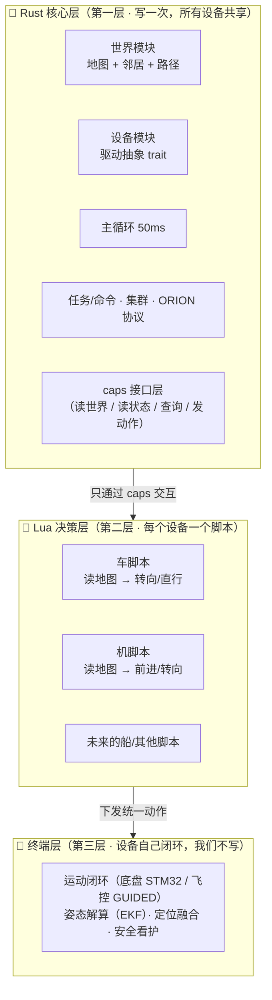

# 通用机器人设计（Universal Robot Design）

Presented by KeJi
Created Date ： 2026-08-19
Modified Date ： 2026-08-20

> 状态：**方案已定稿（2026-08-20）**，尚未开始实施。
> 关联文档：`robot_arch.md`（现状架构）、`UAV.md`（无人机目标平台）、`multi_robot_map.md`（分布式地图一致性）。

---

## 1. 背景与目标

### 1.1 问题

当前 `Src/Robot/` 子系统为 **2D 轮式车专用**：STM32 底盘串口协议、差速/麦轮运动模型、2D 占据栅格建图、2D D* Lite 寻路、`CarType`（X3/X3Plus/X1/R2）配置。调研结论：核心逻辑约 60~70% 是车专用。

要扩展到 **无人机（DRF450 四旋翼，Pixhawk 2.4.8 + ArduPilot + MAVLink）**，乃至未来的船/履带等平台，直接改会造成大量耦合。

### 1.2 目标

让系统**通用化**：有一套「我们自己的逻辑」（设备无关、稳定），设备（车/机/船）像插件一样插入各自的适配逻辑。

### 1.3 约束（比赛场景）

- 设备在比赛前已确定，**不存在临时插入新设备**的情况；
- 因此「不重新编译」不是硬需求 —— **重新编译是可接受的**；
- 插件加载采用 **编译期 + config 配置**，不做运行时 `.so` 动态库（Rust 无稳定 ABI，跨 `.so` 需 C ABI + 版本配平，成本高、收益低）。

---

## 2. 核心设计原则

1. **驱动必须 Rust**：协议编解码 + 硬件 IO（串口/MAVLink 帧解析、字节流处理）用 Rust 写。Lua 写驱动不靠谱（性能、二进制协议正确性、硬件安全、并发生命周期四方面均不适合）。

2. **世界地图是通用的，不是 SLAM**：每个设备（车/机/船）都需要知道自己在「游戏世界」中的位置。真正设备专属的是「感知/定位手段」（车 = LiDAR 建图 + 里程计；机 = 读飞控 EKF），而非「世界地图」本身。世界地图（数据结构 + 全局同步）是所有设备共享的核心状态。

3. **Rust 拥有事实，Lua 只做抉择**：地图「真值」只在 Rust 侧（单一事实来源），Lua 读到的是一份视图，不能改底层数据。Lua 只做「读状态 → 算 → 选动作」的决策。

4. **世界/地图访问 = caps 接口**：Rust 把「读地图、读状态、查询、发动作」开放成一组 caps，飞机/车各自的 Lua 脚本自行抉择怎么用。

5. **caps 设计：primitive 为体、便捷方法为糖**：接口分两层 —— 底层 primitive（最小完备集，如 `get_cell` / `set_velocity`）是「能力」；高层便捷方法（如 `get_path`）是 Rust 封装好的「现成实现」，Lua 可用可不用。只要 primitive 齐全，Lua 理论上能写出任何逻辑。

6. **Lua 执行模型 = Rust 定时器驱动**：Lua 实例跑在专用线程；Rust 侧 `tokio::interval(50ms)` 每个 tick 调一次 Lua 的**无状态决策函数**（喂输入 → 返回动作，立即返回）。Lua 不自己 sleep 循环（会阻塞单线程 Lua 实例）。50ms = 20Hz，对微秒级的决策开销毫无压力。

7. **加载方式 = config 开关 + 遍历 spawn**：机器人不是「单一类型」，而是「**设备的组合**」。`config.toml` 里每个设备一个 `enabled` 布尔开关，启动时遍历配置、spawn 所有 `enabled=true` 的设备。加新设备 = config 加一段 + 注册表加一项，不需要改主流程分支。

8. **设备依赖不做代码兜底**：设备之间的依赖（如执行逻辑依赖底盘、建图依赖雷达）由配置者自行保证，代码不做启动校验/依赖检查。

---

## 3. 总体架构（三层）



| 层 | 归属 | 职责 | 示例 |
|---|---|---|---|
| 第一层 | Rust | 维护「事实」：世界地图、设备驱动、主循环、任务/命令、集群、协议 | `OccupancyGrid`、`MotionDevice`、`Robot::launch` |
| 第二层 | Lua | 做「抉择」：每个设备一个决策脚本 | 车脚本、机脚本 |
| 第三层 | 终端 | 设备自己闭环，我们零代码 | 底盘 STM32、飞控 Pixhawk |

**关键认知**：车机的差异被压缩到最小——「世界地图」「导航模型（走格子）」「动作语义（前进/转向/停）」三层全部统一，唯一不同的只剩「底层协议编解码」（`FUNC_CAR_RUN` vs MAVLink），由底盘/飞控各自闭环。

---

## 4. 世界模块（World Module）

**定位**：Rust 维护的「世界」唯一访问入口，开放给 Lua。不叫「寻路模块」，因为它的职责是「访问世界」这件事，而非某个算法。

world 是一个**大模块**，内含三个子模块：

| 子模块 | 接口示意 | 说明 | 对应 Rust 现状 |
|---|---|---|---|
| **static（静态地图）** | `get_cell(x, y) -> Free/Occupied/Unknown` | 墙、LiDAR 障碍；**不合并动态障碍** | `grid`（OccupancyGrid） |
| **dynamic（动态设备）** | `get_agents() -> 其他设备位置/速度列表` | 其他设备在哪（原 cluster 归入） | `cluster_table`（ClusterInfoTable） |
| **pathfinding（寻路）** | `get_path() -> 下一步/None` | D* 封装，无参（goal 由 Rust 设进 D*）；有任务返回下一步，无任务返回 None | `pathfinder`（DStarLite） |

**邻居定义**：当前统一 **4 连通**（走格子，车机一致）；真 3D（26 连通）留后续。4 连通是固定的，Lua 自行计算邻居（上下左右），**不单独暴露 `get_neighbors`**。

**决策**：寻路（D* Lite）放 Rust，作为 `get_path` 提供；`get_cell` 同时开放，Lua 想自己写寻路也完全自由。两条路不冲突。

**导航模型统一（走格子）**：车和机**共用同一套网格导航模型**——D* Lite 在网格上寻路、输出「下一格」。车从格 A 走到格 B，机从格 A 飞到格 B（固定高度平面走 2D 格子，升降另作独立通道）。这是车机最根本的统一层。

**动作语义统一**：车和机在「动作」层面也是统一的——「前进 / 后退 / 左转 / 右转 / 停」这套离散动作，车机语义完全相同（前进 = 朝机头/车头方向，停 = 停车/悬停）。唯一不同的是底层协议翻译：车走 `FUNC_CAR_RUN`（预设方向帧），机走 MAVLink 速度/yaw 指令。因此统一动作接口直接沿用 `ManualCmd` 的动作集，不需要发明 `set_velocity`。

---

## 5. 设备模块（Device Module）

**定位**：设备 = **自包含的能力单元**（对应 ROS2 的 Hardware Interface）。每个设备是一个模块，内含四块：独立 config + 构造（`start`）+ `MotionDevice` trait 实现 + 状态写入，四者内聚在同一模块。

**`MotionDevice` trait（统一运行期行为）**：

```rust
pub trait MotionDevice: Send + Sync {
    fn move_forward(&self, speed: i16) -> Result<(), String>;
    fn move_backward(&self, speed: i16) -> Result<(), String>;
    fn turn_left(&self, rate: i16) -> Result<(), String>;
    fn turn_right(&self, rate: i16) -> Result<(), String>;
    fn stop(&self) -> Result<(), String>;
    fn shutdown(&self);
}
```

**关键决策**：`start`（构造）**不进 trait**——每个设备的 `start` 参数是各自的 config 类型（`Stm32Device::start(&ChassisConfig)` vs `MavlinkDevice::start(&FlightCtrlConfig)`），签名天然不同；trait 只统一「运行期动作 + shutdown」。

- `ChassisDevice`（STM32 轮式底盘）
- `LidarDevice`（雷达，**内含 SLAM 建图**）
- `FlightCtrlDevice`（Pixhawk 飞控，未来）
- 未来的船/履带等

### 5.1 设备内部打包 tokio 组

| 设备 | `start()` 内部 spawn 的 tokio |
|---|---|
| 底盘设备 | 串口读写 tokio（＋未来的执行翻译逻辑） |
| 雷达设备 | ① 串口读数据 tokio ② **SLAM 建图 tokio** |
| 飞控设备 | ① MAVLink 通信 tokio ② 状态映射（EKF → RobotState） |

**关键决策**：SLAM 建图 task 跟雷达**绑定在一起**，而不是通用层的独立 task——因为 SLAM 依赖雷达数据，强耦合；`lidar.enabled=true` 就代表"我要感知能力"，读数据和建图一起给。

### 5.2 执行逻辑下沉（executor 拆分）

当前 `executor.rs` 拆成两层：

- **Rust 侧（通用任务执行框架）**：任务管理（pop Mission、群发分配、设 goal 进 D*）+ 急停（前方障碍强制 stop）+ 每 50ms 调 Lua `on_tick` 并下发动作。
- **Lua 侧（决策脚本）**：拿下一步（`get_path`）、算角偏差、转向/直行决策。

Idle/Turning/Moving 状态机**取消**——无状态决策取代（见 §8）。

---

### 5.3 设备各自写状态（z 维度）

`RobotState` 增加 `z: f32`（垂直/高度，全局世界坐标）。**z 的写入者 = 设备自己**：

- 车设备（STM32）：`z` 恒写 `0`（地面车无高度，origin 注入后不再变化，`odometry` 不积分 z）
- 机设备（飞控）：`z` 由飞控 EKF 高度直接覆盖写

广播同步加 z：`Pose` 结构已有 z（`state_notifier` 从硬编码 `0.0` 改为 `s.z`）；`PoseData` 协议加 `z: f32`，**33 → 37 字节**，`decode_pose` 长度校验同步改，地面站（Pictor）解析同步升级。

速度字段同理：`RobotState.vz` **回归「垂直速度」定义**（机=飞控垂速，车恒 0）；原「偏航角速度」语义（`RPT_SPEED` 第三槽）是死数据——yaw 直接来自 IMU、不积分角速度，故**直接删除角速度语义，不另设 `yaw_rate`**。

### 5.4 设备实现方法（独立 config + 模块内聚）

每个设备 = 一个自包含模块，四块内容内聚：

| 块 | 车（STM32） | 机（MAVLink，未来） |
|---|---|---|
| config | `ChassisConfig { enabled, port, baudrate, car_type }` | `FlightCtrlConfig { enabled, connection }` |
| 构造 | `Stm32Device::start(&ChassisConfig) -> Box<dyn MotionDevice>` | `MavlinkDevice::start(&FlightCtrlConfig) -> Box<dyn MotionDevice>` |
| 行为 | `impl MotionDevice`（move_forward → FUNC_CAR_RUN） | `impl MotionDevice`（move_forward → MAVLink 速度） |
| 状态 | 写 `RobotState`（z=0） | 写 `RobotState`（z=飞控 EKF） |

bootstrap 里遍历：每设备一行 if-let，读各自 config、调各自 start：

```rust
let mut devices: Vec<Box<dyn MotionDevice>> = vec![];
if let Some(cfg) = &config.chassis     { if cfg.enabled { devices.push(Stm32Device::start(cfg)?); } }
if let Some(cfg) = &config.lidar       { if cfg.enabled { devices.push(LidarDevice::start(cfg)?); } }
if let Some(cfg) = &config.flight_ctrl { if cfg.enabled { devices.push(MavlinkDevice::start(cfg)?); } }
```

## 6. 启动流程（Robot::launch）

### 6.1 当前流程（robot.rs:85-241）

```
① 创建共享状态：robot_state / lidar_state / grid(世界地图) / op_mode / mission_queue / execute_state / cluster_table
② 广播通道：pose_tx / map_tx
③ spawn 设备：STM32Device::spawn（必）+ LidarDevice::spawn（可选）  ← 写死
④ state_notifier（100ms）：读状态 → 广播位姿给集群
⑤ slam_task（建图）：读雷达 + 状态 → 更新 grid → 广播地图增量        ← 写死
⑥ cluster_consumer：收他车 POSE/MAP_DELTA → 集群表 + 合并地图
⑦ cluster_table_cleaner（2s）：清理失联车
⑧ command_consumer：收命令帧 → Command
⑨ main_loop（50ms）：select! 三分支 = 命令 / auto_tick / cancel
⑩ 返回 Robot（持有各状态句柄）
```

### 6.2 通用化后的流程

```
① 共享状态（通用，保留）
② 广播通道（通用，保留）
③ 遍历 config.devices，spawn 所有 enabled=true 的设备            ← 分发点
   ├─ 车：chassis=true + lidar=true
   └─ 机：flight_ctrl=true + 测距=true
④ state_notifier（通用，保留）
⑤ 感知 task（设备自带）：原来写死的 slam_task 归入雷达设备 start() 内
   ├─ 车：lidar.start() 内部 spawn 读数据 + SLAM 两个 tokio
   └─ 机：fc.start() 内部 spawn MAVLink + 状态映射
⑥⑦⑧ 集群/清理/命令（通用，保留）
⑨ main_loop（通用骨架，保留；决策部分下沉到 Lua）
```

**变化只有两处**：③ 从「写死 spawn STM32+LiDAR」变成「遍历开关」；⑤ 从「写死 slam_task」变成「设备自带感知」。其余骨架全不动。

---

### 6.3 主循环 main_loop（运行核心，robot.rs:400-517）

`main_loop` 是「运行」的核心，一个 3 分支 `select!` 循环：

| 分支 | 触发 | 行为 |
|---|---|---|
| cmd | 收到 Command | Mode（切模式/清队列）、Manual（`dispatch` 下发动作）、Auto（替换队列）、None（退出） |
| auto_tick | 50ms，仅 Auto | 读状态快照 → 算动态障碍 → `executor.step()`（决策入口） |
| cancel | 退出信号 | 停车 → 停雷达 → shutdown |

**通用化关键点**：

- **通用骨架（保留）**：三分支 `select!` 结构、Mode/Auto 命令处理、读快照 + 算动态障碍、50ms 节拍。
- **车专用耦合（要改）**：`dispatch` 的 forward/backward/spin 等车动作、`executor.step(&stm32, ...)` 直接持有设备具体类型、退出清理的设备特定调用。
- **决策入口**：auto_tick 里的 `executor.step(...)` 就是「Rust 50ms 定时器驱动 Lua 决策」的落点——通用化后变为 `lua_decide(状态快照) → device.apply(动作)`。

## 7. caps 接口集（定稿）

Lua 脚本面对的能力边界 = caps 集合。分「底层 primitive」和「高层便捷方法」两层：

### 7.1 底层 primitive（最小完备集，必须）

| 模块 | 接口示意 | 说明 |
|---|---|---|
| self | `get_position()` → (x, y, z) | 全局世界坐标 |
| self | `get_attitude()` → (roll, pitch, yaw) | 姿态（yaw 直接来自 IMU） |
| self | `get_velocity()` → (vx, vy, vz) | 线速度（vz = 垂直速度，车恒 0） |
| world.static | `get_cell(x, y)` | 静态地图（Free/Occupied/Unknown，不含动态障碍） |
| world.dynamic | `get_agents()` | 其他设备位置/速度 |
| world.pathfinding | `get_path()` | **完整目标服务**（内部封装到达检测 + 任务切换 + 寻路）；有下一步返回格，队列空返回 nil |
| action | `move_forward/backward` / `turn_left/right` / `stop` | 统一动作（stop = 停车/悬停） |

> **命名空间说明**：`world.static` / `world.dynamic` / `world.pathfinding` 是设计上的**组织子模块标签**（对应 Rust 侧 world 大模块的三个子模块）；Lua 侧命名空间为**扁平**的 `self.` / `world.` / `action.`（如 `world.get_path()`、`world.get_cell(x,y)`、`action.stop()`），不再嵌套子表。

> **mission 不开放**：任务队列（mission_queue）由 Rust 管理（命令层下发 + 群发分配 + 设 goal 进 D*），不开放给 Lua；Lua 通过 `get_path()` 的返回值（Some/None）感知「有无任务」，不需要 `get_goal`/`get_mode`。

> **takeoff/land 归 ManualCmd**：起飞/降落是遥控阶段（手动模式），加进 `ManualCmd` 手动命令集、Rust 直接下发；**不进 action**（Lua 决策动作集）。流程：手动起飞 → 切 Auto 走格子 → 切回手动降落。

### 7.2 高层便捷方法（可选「糖」）

| 接口示意 | 说明 |
|---|---|
| （未来）`goto(x, y)`、`circle(...)` 等 | 随用随加 |

**原则**：重心放在 primitive 的最小完备集上；高层方法都是可以后来慢慢加的糖。

---

## 8. Lua 决策脚本形态

- **执行模型**：Rust `tokio::interval(50ms)` 驱动，每个 tick 调一次 **无状态决策函数 `on_tick()`**，Lua 立即返回。
- **无状态决策（状态机砍掉）**：executor 的 Idle/Turning/Moving 状态机**取消**——每 tick 重新决策「下一格 → 角偏差 → 转向/直行」，逻辑自然收敛，无需显式状态转移。
- **脚本生命周期**：决策脚本放 `programs/robot/` 目录；启动时由 robot 主循环**主动加载**（非 COMMAND 按命令执行）；使用**独立 `LuaContext`**（与推理脚本隔离，避免推理长任务/死循环干扰实时控制）。
- **`get_path()` = 完整目标服务（有状态，Rust 内部）**：封装「到达检测（世界距离阈值）+ 任务切换（pop + 群发分配 + 设 goal 进 D*）+ 寻路（D* next_step）」。Lua **无状态**——只看到稳定的「下一步」或 nil，不感知背后的到达检测和任务切换；**无需 next_mission**（任务切换已在 get_path 内部完成）。
- **示例形态**（车脚本，机脚本同构）：

```lua
function on_tick()
    local x, y = self.get_position()
    local yaw = self.get_attitude().yaw

    local next = world.get_path()   -- 下一步格，或 nil
    if next == nil then
        action.stop()               -- 没任务/已到达 → 停
        return
    end

    local tx = (next.gx + 0.5) * 0.5   -- 格中心世界坐标（CELL_RESOLUTION=0.5）
    local ty = (next.gy + 0.5) * 0.5
    local delta = normalize_angle(math.atan(ty - y, tx - x) - yaw)

    if math.abs(delta) > 0.087 then     -- 5° 阈值
        if delta > 0 then action.turn_right(10) else action.turn_left(10) end
    else
        action.move_forward(30)
    end
end
```

---

## 9. 关键设计决策汇总

| # | 决策 | 结论 |
|---|---|---|
| 1 | 驱动放哪 | **Rust**（Lua 写驱动不靠谱） |
| 2 | 世界地图 | **Rust 维护，通用**（非设备专属；「建图/定位手段」才是设备专属） |
| 3 | 决策（执行/分配/感知策略）放哪 | **Lua 脚本**，每个设备一个 |
| 4 | 寻路放哪 | **Rust**（世界模块 `get_path`），Lua 也可自己写 |
| 5 | 邻居定义 | **4 连通固定**（真 3D 的 26 连通留后续），不暴露 `get_neighbors` |
| 6 | 高度维度 | **先固定 2D + 高度独立通道**（真 3D 寻路以后按需加） |
| 7 | 插件加载 | **config 开关 + 遍历 spawn**（机器人 = 设备组合，非单一类型） |
| 8 | SLAM 归属 | **归入雷达设备**（设备 = 能力单元，`start()` 打包 tokio 组） |
| 9 | 设备依赖 | **不做代码兜底**，配置者自行保证 |
| 10 | Lua 节拍 | **Rust 定时器驱动** 50ms 无状态决策 |
| 11 | 导航模型 | **统一走格子**（车机共用 D* Lite 网格导航，机在固定高度平面走 2D 格子） |
| 12 | 动作语义 | **统一离散动作**（前进/后退/左转/右转/停，车机语义一致；只有底层协议翻译不同） |
| 13 | 状态维度 z | `RobotState` 加 z；写入者 = 设备自己（车写 0，机写飞控 EKF）；`PoseData` 加 z（33→37 字节，同步地面站） |
| 14 | world 结构 | world 大模块含三子模块（static 地图 / dynamic 设备 / pathfinding 寻路）；cluster 归入 world.dynamic |
| 15 | get_cell | 只返回静态地图，不合并动态障碍（动态障碍走 world.dynamic.get_agents） |
| 16 | get_path | **无参**（goal 由 Rust 设进 D*）；有任务返回下一步，无任务返回 None |
| 17 | mission 不开放 | 任务队列由 Rust 管理，不开放给 Lua；Lua 通过 get_path 返回值感知任务 |
| 18 | takeoff/land | 归 ManualCmd（手动命令，遥控阶段），不进 action（Lua 决策动作集） |
| 19 | MotionDevice | trait 只统一运行期动作（move_forward/turn/stop）+ shutdown；start 不进 trait（各自构造） |
| 20 | 设备 config | 每个设备独立 config（ChassisConfig/FlightCtrlConfig...），不合并成大杂烩 DeviceConfig |
| 21 | 设备模块 | 设备 = 自包含模块（config + 构造 + trait 实现 + 状态写入 内聚） |
| 22 | 状态机 | Idle/Turning/Moving **取消**，无状态决策取代（每 tick 重新决策） |
| 23 | executor 拆分 | Rust 留任务管理+急停+下发；Lua 拿决策（get_path+角偏差+转向/直行） |
| 24 | get_path 语义 | **完整目标服务**（内部封装到达检测 + 任务切换 + 寻路）；Lua 无状态，nil=队列空 |
| 25 | 脚本生命周期 | programs/robot 目录 + 启动主动加载 + 独立 LuaContext（与推理隔离） |
| 26 | 锁 | 保持 tokio::sync::RwLock + caps 异步函数（不换 std 锁，task_22_1 已取消） |

---

## 10. 与现有代码的映射（现状 → 目标）

| 现有模块 | 现状 | 目标归属 |
|---|---|---|
| `control/device/stm32` | 车底盘驱动（唯一实现） | 设备模块（能力单元之一） |
| `control/serial/port.rs` | 通用串口 TX/RX | 设备模块底层载体（保留） |
| `slam/grid.rs`（own/merged 双表） | 世界地图数据结构 | **世界模块（第一层，通用）** |
| `slam/` 的差分广播 / CRDT | 地图全局同步 | **世界模块（第一层，通用）** |
| `slam/lidar_mapper.rs` | LiDAR 建图 | **归入雷达设备**（与 `control/device/lidar` 合并成感知单元） |
| `slam/odometry.rs` | 里程计积分 | 车的定位手段（归入底盘/车设备侧） |
| `core/state.rs` 的 `RobotState` | 只有 x/y | 加 `z: f32`（设备各自写：车写 0，机写飞控） |
| `protocol/messages.rs` 的 `PoseData` | 33 字节无 z | 加 z → 37 字节（同步地面站） |
| `core/cluster/`（ClusterInfoTable 等） | 集群数据面 | 归入 world.dynamic 子模块；`ClusterInfo` 加 z |
| `core/robot.rs` 的 `slam_task` | 独立建图 task | **归入雷达设备 `start()` 内部** |
| `core/executor.rs` | 目标跟踪 + 车专用转向/直行 | 拆：通用目标跟踪（Rust）+ 车动作翻译（下沉设备/Lua） |
| `core/planning/pathfinder.rs` | D* Lite（4 连通写死） | 世界模块 `get_path`（4 连通固定，不暴露 `get_neighbors`） |
| `core/planning/assignment.rs` | 分配框架 + 2D 几何 | 框架通用（Rust）+ 几何抉择（Lua） |
| `core/robot.rs` 主循环 | 中枢 | **第一层（通用，保留）** |
| `core/` 命令/任务/集群/协议 | — | **第一层（通用，保留）** |
| `bootstrap.rs` 的 `robot_bootstrap` | 读配置 → `Robot::launch` | 改为「遍历 config 开关 spawn」 |
| `VM/capability_binding.rs` 的 `register_robot_caps` | 空 stub | **caps 接口落点**（补全） |

---

## 11. 待定项与下一步

| 待定项 | 状态 |
|---|---|
| 急停（Rust 强制 stop）与 Lua 决策的优先级/时序 | 实施时定 |
| D* 独立后的锁序（D* → robot_state → cluster_table → grid） | 实施时定 |
| caps 边界情况（get_cell 越界、get_path nil 语义细节） | 实施时定 |
| 机脚本 / `MavlinkDevice` 示例实现 | 后续 task（等机硬件） |

---

## 附：术语表

- **世界模块（World Module）**：Rust 维护的世界地图 + 空间查询能力（地图/邻居/路径），开放给 Lua。
- **设备模块（Device Module）**：自包含的能力单元，`start()` 一键拉起内部 tokio task 组。
- **caps**：Rust 开放给 Lua 的接口集。
- **primitive**：底层原子能力（最小完备集）。
- **便捷方法（糖）**：Rust 封装好的高层现成实现，Lua 可选。
- **终端**：设备自己的控制器（底盘 STM32 / 飞控 Pixhawk）。
- **单一事实来源**：世界地图真值只在 Rust，Lua 只读视图。
